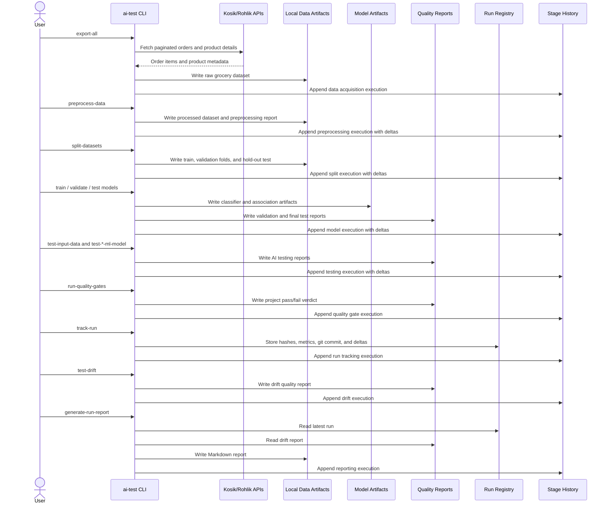

# AI Grocery Testing

Python project for preparing grocery order data for AI testing practice.

Current scope:

- collect order-item data from Kosik and Rohlik;
- normalize both shops into one raw dataset;
- preprocess raw data into a compact modeling dataset;
- create training, validation, and test datasets;
- build supervised classification datasets;
- train, validate, and test a supervised category classifier;
- train, validate, and test an association rules model on training data, k-fold validation data, hold-out test dataset;
- test input data quality and split integrity;
- test ML model reports against acceptance criteria;
- aggregate project quality gates for a single pass/fail verdict;
- track versioned pipeline runs with data/model/report hashes and metric deltas;
- record every result-producing command in a per-stage execution history;
- test data drift and metric regressions against a baseline run;
- generate human-readable Markdown reports for JSON evidence;
- generate a classifier explainability report;
- prepare LLM exploratory testing charters;
- generate a data quality report.

## Tech Stack

Current stack:

- Python 3.10+
- `argparse` CLI exposed as `ai-test`
- JSON / JSONC configuration
- `pandas` / `pyarrow` for tabular data foundations
- `scikit-learn` for supervised text classification
- `joblib` for model artifact persistence
- `pandera` for dataframe validation schemas
- `pydantic` / `pydantic-settings` for typed configuration foundations
- Apriori association rules implementation
- `pytest` smoke tests
- `ruff`, `mypy`, `pre-commit`
- GitHub Actions CI
- optional `MLflow` experiment tracking
- optional `DVC` data/model/report versioning

Planned reporting and MLOps stack:

- `matplotlib` / `seaborn` for analysis charts
- `pytest` for pipeline checks

## Project Structure

```text
config/
  defaults.jsonc              # non-secret runtime defaults
src/ai_testing/
  cli.py                      # ai-test entrypoint, parser, and core pipeline commands
  cli_common.py               # shared CLI IO, config, cookie, and reporting helpers
  cli_reporting.py            # run tracking, drift, Markdown, explainability, and LLM commands
  config.py                   # JSONC config loader
  core/
    reports.py                # common report/check schema
    quality_gates.py          # generic quality gate evaluation
    artifacts.py              # artifact metadata and hashes
  data_acquisition/
    common.py                 # shared HTTP/data helpers
    kosik.py                  # Kosik adapter and mapping
    rohlik.py                 # Rohlik adapter and mapping
  data_preprocessing/
    grocery.py                # feature selection and quality report
  data_splitting/
    grocery.py                # train/test and k-fold validation split
  classification_preprocessing/
    grocery.py                # supervised text/label dataset builder
  input_data_testing/
    grocery.py                # input data and split integrity tests
  drift_testing/
    run_drift.py              # run-to-baseline drift and regression checks
  model_training/
    text_classifier.py        # scikit-learn category classifier training
    association.py            # association rules training
  model_validation/
    text_classifier.py        # k-fold classifier validation
    association.py            # k-fold association evaluation
  model_testing/
    text_classifier.py        # hold-out classifier test report
    association.py            # hold-out association test report
  ml_model_testing/
    association.py            # model acceptance tests
    text_classifier.py        # classifier acceptance tests
  model_explainability/
    text_classifier.py        # classifier token-level explanation report
  llm_exploratory_testing/
    charters.py               # LLM exploratory testing charters
  project_quality/
    gates.py                  # aggregated project quality gates
  reporting/
    generic_markdown.py       # JSON report to Markdown table renderer
    run_markdown.py           # human-readable run report generation
  run_tracking/
    mlops.py                  # optional MLflow logging and DVC artifact versioning
    tracker.py                # run registry, artifact hashes, metric deltas, drift summary
    stage_history.py          # per-stage command execution history and deltas
  sample_data.py              # synthetic data for smoke checks
data/                         # generated locally, ignored by git
secrets/                      # local cookies, ignored by git
tests/                         # pytest smoke tests with synthetic data
```

## Architecture

The CLI is intentionally thin: it reads config, resolves artifact paths, and calls pipeline stages.
Shared report and quality primitives live in `src/ai_testing/core/`.

Current architectural layers:

- `core`: report schema, check results, quality gates, artifact metadata;
- `data_*`: acquisition, preprocessing, and splitting;
- `classification_preprocessing`: supervised text/label dataset builder;
- `model_training`, `model_validation`, `model_testing`: model lifecycle stages;
- `input_data_testing`, `ml_model_testing`: quality verdicts built on top of reports and artifacts.
- `drift_testing`: run-to-baseline drift and metric regression checks.
- `project_quality`: one project-level verdict built from data and model quality reports.
- `run_tracking`: versioned run reports plus per-stage execution history and metric deltas.
- `reporting`: Markdown reports for human review.

```mermaid
flowchart LR
    subgraph Sources["External Data Sources"]
        Kosik["Kosik API"]
        Rohlik["Rohlik API"]
    end

    subgraph DataPipeline["Data Pipeline"]
        Acquisition["Data Acquisition"]
        Raw["Raw Dataset"]
        Preprocessing["Data Preprocessing"]
        Processed["Processed Dataset"]
        Splitting["Training / Validation / Test Split"]
        ClassificationPrep["Classification Dataset Builder"]
    end

    subgraph Models["Model Lifecycle"]
        CategoryTrain["Train Category Classifier"]
        CategoryValidation["K-Fold Classifier Validation"]
        CategoryTest["Hold-Out Classifier Test"]
        AssociationTrain["Train Association Rules"]
        AssociationValidation["K-Fold Association Validation"]
        AssociationTest["Hold-Out Association Test"]
    end

    subgraph Quality["AI Testing and Reporting"]
        InputTesting["Input Data Testing"]
        ModelTesting["ML Model Testing"]
        ProjectGates["Project Quality Gates"]
        RunTracking["Run Tracking"]
        StageHistory["Stage Execution History"]
        DriftTesting["Drift Testing"]
        HumanReport["Markdown Run Report"]
        Explainability["Classifier Explainability"]
        LLMExploratory["LLM Exploratory Charters"]
    end

    Kosik --> Acquisition
    Rohlik --> Acquisition
    Acquisition --> Raw --> Preprocessing --> Processed --> Splitting
    Splitting --> ClassificationPrep
    ClassificationPrep --> CategoryTrain --> CategoryValidation --> CategoryTest
    Splitting --> AssociationTrain --> AssociationValidation --> AssociationTest
    Processed --> InputTesting
    CategoryValidation --> ModelTesting
    CategoryTest --> ModelTesting
    AssociationValidation --> ModelTesting
    AssociationTest --> ModelTesting
    InputTesting --> ProjectGates
    ModelTesting --> ProjectGates
    Acquisition -.-> StageHistory
    Preprocessing -.-> StageHistory
    CategoryTest -.-> StageHistory
    AssociationTest -.-> StageHistory
    InputTesting -.-> StageHistory
    ModelTesting -.-> StageHistory
    ProjectGates --> RunTracking
    RunTracking --> DriftTesting --> HumanReport
    StageHistory --> HumanReport
    CategoryTrain --> Explainability
    LLMExploratory --> HumanReport
```





Testing reports follow one shape: `report_type`, `subject`, `status`, `summary`, `checks`, and
optional `artifacts`. Failed checks can include `diagnostics` with affected counts, breakdowns,
sample records, and suggested actions.

## Configuration

Runtime defaults are in:

```text
config/defaults.jsonc
```

The config controls shop URLs, API paths, pagination limits, output paths, enrichment flags, and the
preprocessing feature whitelist. CLI arguments override config values.

## Secrets

Create local cookie files:

```text
secrets/kosik.cookies.txt
secrets/rohlik.cookies.txt
```

Each file should contain one authenticated browser `Cookie` header value. Do not commit secrets or
exported datasets.

## Commands

Install:

```powershell
python -m pip install -e ".[dev]"
```

Run synthetic sample export:

```powershell
ai-test export-sample
```

Run data acquisition:

```powershell
ai-test export-all
```

Run shops separately:

```powershell
ai-test export-kosik
ai-test export-rohlik
```

Run preprocessing:

```powershell
ai-test preprocess-data
```

Create training, validation, and test datasets:

```powershell
ai-test split-datasets
```

Build supervised classification datasets:

```powershell
ai-test build-classification-dataset
```

Train and evaluate the supervised category classifier:

```powershell
ai-test train-category-classifier
ai-test validate-category-classifier
ai-test test-category-classifier
```

Train association rules on training data:

```powershell
ai-test train-associations
```

Validate association rules across folds:

```powershell
ai-test validate-associations
```

Run the final hold-out test:

```powershell
ai-test test-associations
```

Run AI testing stages:

```powershell
ai-test test-input-data
ai-test test-ml-model
ai-test test-category-ml-model
ai-test run-quality-gates
```

Generate explainability, LLM exploratory, and run tracking reports:

```powershell
ai-test explain-category-classifier
ai-test create-llm-exploratory-plan
ai-test track-run --run-name "current-clean-pipeline"
ai-test track-run --run-name "mlops-run" --mlflow-tracking --dvc-versioning
ai-test test-drift
ai-test generate-run-report
ai-test generate-markdown-reports
ai-test run-history
```

Use a custom config:

```powershell
ai-test --config config/defaults.jsonc export-all
```

Useful acquisition options:

```powershell
ai-test export-all --kosik-order-page-limit 150 --rohlik-order-page-limit 150
ai-test export-all --no-product-enrichment
ai-test export-all --include-product-content
ai-test export-all --no-kosik-include-archived-orders
ai-test export-all --no-rohlik-include-archived-orders
```

Run code checks:

```powershell
ruff format --check .
ruff check --no-cache .
mypy --no-incremental src
pytest
```

## Data Acquisition

Data acquisition reads authenticated order history from Kosik and Rohlik APIs. Each purchased product
line is mapped into a shared raw order-item schema. Product enrichment can add category, description,
ingredient, and package metadata when available.

Raw data is written under `data/raw/`.

## Data Preprocessing

Data preprocessing converts raw order items into a compact dataset for future modeling.

It keeps a feature whitelist from `config/defaults.jsonc`, removes technical identifiers and noisy
raw fields, and derives calendar/category features:

- `basket_id`
- `order_month`
- `order_week_of_year`
- `order_day_of_week`
- `order_is_weekend`
- `order_quarter`
- `is_gluten_free`
- `product_group`
- `meat_type`
- `quality_level`

`category_path`, product ids, order ids, URLs, `quantity`, `quantity_delivered`, `price_total`, and
`product_enriched` are removed from the processed dataset.

If `quantity_ordered` is missing, preprocessing fills it from delivered quantity, then from the raw
generic quantity field.

Processed data and the quality report are written under `data/processed/`.

## Dataset Splitting

Dataset splitting creates the datasets needed before supervised model training.

The split is group-aware by `basket_id`, so rows from the same basket stay in the same dataset. This
prevents leakage between training, validation, and test data.

Default strategy:

- hold out a final test dataset;
- use the remaining data for k-fold cross-validation;
- stratify groups by `shop`;
- use a fixed random seed for repeatability.

```powershell
ai-test split-datasets
ai-test split-datasets --n-splits 5 --test-size 0.2
```

Split artifacts are written under `data/splits/` and are ignored by git.

## Supervised Classification

The supervised model predicts product `main_category` from product text. By default, the text is built
from `product_name` and `brand`; category fields are not used as features to avoid leakage.

```powershell
ai-test build-classification-dataset
ai-test train-category-classifier
ai-test validate-category-classifier
ai-test test-category-classifier
```

Artifacts are written to `data/classification/category/`, `data/models/category_classifier.json`,
`data/models/category_classifier.joblib`, `data/validation/category_classifier_validation_report.json`, and
`data/testing/category_classifier_test_report.json`.

Validation accuracy, precision, recall, and F1 are used while evaluating and tuning the model. Test
metrics are the final hold-out result after the model and parameters are selected.

## Model Training

The project currently has two model families:

- supervised text classification for product categories;
- unsupervised association rules for market basket analysis.

Association training uses `data/splits/train_validation.json`, which excludes the hold-out test set.
For fold-specific association experiments, pass a fold training file explicitly:

```powershell
ai-test train-associations
ai-test train-associations --input data/splits/folds/fold_01_train.json
```

The model artifact is written under `data/models/` and contains frequent itemsets, association rules,
and metrics such as support, confidence, lift, leverage, and conviction.

## Model Validation

Association validation trains rules on each fold training dataset and evaluates those rules on the
matching validation dataset.

```powershell
ai-test validate-associations
```

The validation report is written under `data/validation/` and includes fold-level and aggregate
metrics:

- validation confidence;
- validation lift;
- antecedent coverage;
- hit rate;
- train-vs-validation confidence gap;
- stable rule count.

## Model Testing

Final testing evaluates the already trained association model on `data/splits/test.json`.

```powershell
ai-test test-associations
```

The test report is written under `data/testing/`. Use this report once after validation/tuning is
finished. It includes test confidence, test lift, coverage, hit rate, train-vs-test gaps, stable rule
count, and strongest test rules.

## Input Data Testing

Input data testing checks model-ready data and split artifacts:

- required feature columns exist;
- the processed dataset satisfies a `pandera` dataframe contract;
- protected identifiers are absent;
- critical fields are not missing;
- category/product coverage stays within thresholds;
- dates, calendar features, numeric values, and duplicates are valid;
- train/test/fold baskets do not leak across datasets.

```powershell
ai-test test-input-data
```

The report is written to `data/testing/input_data_test_report.json`.

## ML Model Testing

ML model testing checks the trained association model and the validation/test reports against
acceptance criteria. The supervised category classifier has a separate acceptance report with
accuracy, precision, recall, F1, fold stability, hold-out stability, and feature-leakage checks.

```powershell
ai-test test-ml-model
ai-test test-category-ml-model
```

Reports are written to `data/testing/ml_model_test_report.json` and
`data/testing/category_ml_model_test_report.json`. They verify model identity, training/test
separation, forbidden feature usage, validation metrics, final test metrics, and validation-vs-test
stability.

Decision criteria are documented in `docs/model_quality_decision.md`.

## Project Quality Gates

Project quality gates aggregate the input data, association model, and category classifier quality
reports into one main quality report with an explicit `accepted`, `needs_review`, or `rejected`
decision, blockers, warnings, and recommended actions.

```powershell
ai-test run-quality-gates
```

The report is written to `data/testing/project_quality_report.json`. Run
`ai-test generate-markdown-reports` to create the human-readable copy at
`data/reports/project_quality.md`.

## Run Tracking

Run tracking records which data export, processed dataset, split, model, reports, and quality gates
produced a result. It stores SHA256 hashes, git commit, key metrics, label/shop drift summaries, and
metric deltas against the previous recorded run.

Every result-producing command also appends one entry to the stage execution history. That history
shows the latest run of each stage, the previous execution of the same stage, metric deltas, and
linked artifacts.

The metric history report pivots recent executions into comparison tables such as
`Metric | Run 1 | Run 2 | Run 3`, with one section per stage and check-status matrices where checks
are available.

```powershell
ai-test track-run --run-name "experiment-name"
ai-test run-history
```

Optional MLflow/DVC integration:

```powershell
python -m pip install -e ".[mlops]"
dvc init
ai-test track-run --run-name "experiment-name" --mlflow-tracking --dvc-versioning
```

MLflow uses `sqlite:///data/mlflow/mlflow.db` by default and receives run parameters, metrics,
tags, and selected non-dataset artifacts. If you already have useful old `./mlruns` data, migrate it
with `mlflow migrate-filestore` before relying on the new SQLite backend. DVC tracks the configured
processed datasets, split manifests, models, and quality reports as lightweight `.dvc` metadata. Raw
exports are not selected for DVC by default.

Look at these local artifacts for run comparisons:

- `data/runs/<run_id>/run_report.json`
- `data/runs/<run_id>/run_report.md`
- `data/runs/run_index.json`
- `data/runs/stage_history.json`
- `data/reports/stage_history.md`
- `data/reports/stage_metric_history.md`

Artifacts are ignored by git.

## Drift Testing

Drift testing evaluates a tracked run against its baseline run. It checks metric regressions,
critical metric tolerance, and total variation distance for monitored label/shop distributions.

```powershell
ai-test test-drift
```

The report is written to `data/testing/drift_test_report.json`. After it exists, it can be included
in project gates:

```powershell
ai-test run-quality-gates --drift-report data/testing/drift_test_report.json
```

## Run Reports

Run reports convert machine-readable run and drift evidence into a concise Markdown report for human
review.

```powershell
ai-test generate-run-report
ai-test generate-markdown-reports
```

Reports are written under `data/reports/`. `generate-run-report` renders the latest run report, while
`generate-markdown-reports` renders all configured JSON reports into human-readable Markdown tables.
The stage history and metric history Markdown reports are refreshed automatically by commands that
record stage results.

## Explainability

The category classifier explainability report lists the highest-probability text tokens per class for
the trained Multinomial Naive Bayes model.

```powershell
ai-test explain-category-classifier
```

The report is written to `data/explainability/category_classifier_explanation_report.json`.

## LLM Exploratory Testing

The LLM exploratory block creates session-based test charters for future LLM features: boundary
inputs, out-of-domain requests, prompt injection, multilingual noise, consistency, and privacy.

```powershell
ai-test create-llm-exploratory-plan
```
